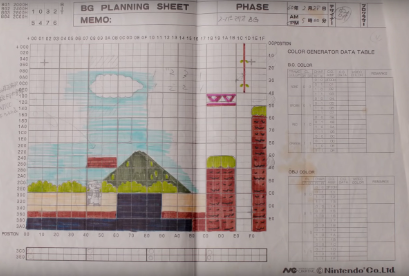
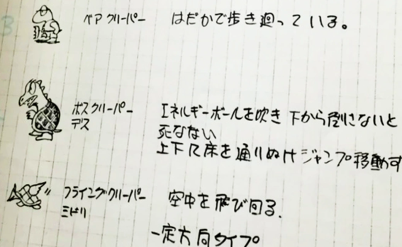
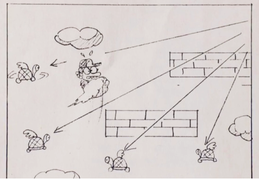
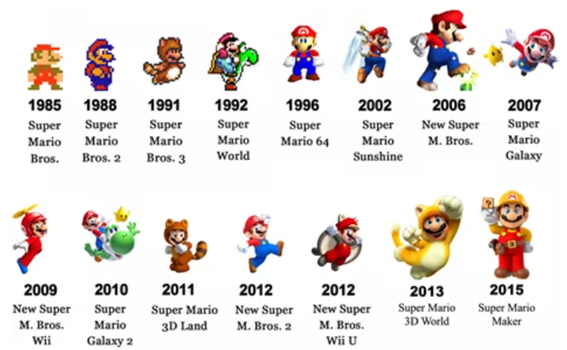

# Concepto y creación

 

 

## Creación

### Nintendo.

Estos bocetos (debidamente coloreados) constituían la materia prima de los programadores y la suya no era tarea fácil. De hecho, en muchas ocasiones no podían ver el resultado digitalizado hasta el día siguiente.

Miyamoto y Tekuza reúnen estos papeles que aún conservan y cuentan la historia a colación del 'Super Mario Maker', dado que la idea era que crear un mundo de Mario fuese algo sencillo e intuitivo, más parecido a la programación orientada a objetos que a desarrollo de código puro y duro para que cualquiera pudiese diseñar un mod. O, como dice Miyamoto, que crear un juego sea un juego.

Para hacer la primera gran aventura de Mario, el equipo de Nintendo, con Shigeru Miyamoto a la cabeza, tuvo que diseñar cada nivel dibujándolo en un papel cuadriculado. Así, empezaron a plantear ideas de habilidades y power-ups para el fontanero. Entre las ideas, propusieron que volara subiéndose en nubes y disparando bolas de fuego. Es precisamente con esa idea con la que nace uno de los primeros bocetos de Super Mario Bros e incluso del propio Bowser:

 <figcaption>
 Evolución de Mario a tráves del tiempo</figcaption>
<
